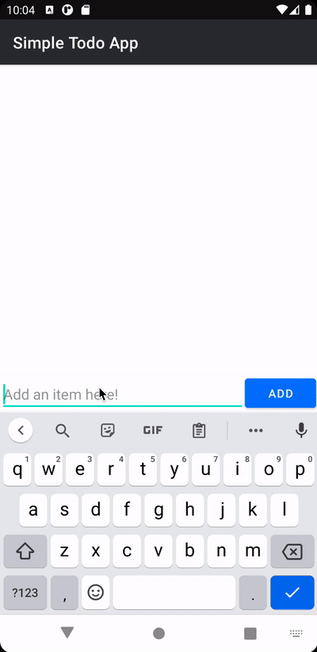

# Project 1 - *Simple Todo*

**Simple Todo** is an android app that allows building a todo list and basic todo items management functionality including adding new items, editing and deleting an existing item.

Submitted by: **Carlos Rodriguez Garcia**

Time spent: **5.5** hours spent in total (4.5 hours on basic requirements, 1 hour on bonus feature)

## User Stories

The following **required** functionality is completed:

* [x] User can **view a list of todo items**
* [x] User can **successfully add and remove items** from the todo list
* [x] User's **list of items are persisted** across app restarts

The following **bonus** features are implemented:

* [x] User can **tap a todo item in the list and bring up an edit screen for the todo item** and then have any changes to the text reflected back in the todo list

## Video Walkthrough

Here's a walkthrough of implemented user stories:

GIF created with [Kap](https://getkap.co/).

## Notes

* I did two FileUtils imports that were blocking each other: android.os.FileUtils and org.apache.commons.io.FileUtils
* At first I had a hard time understanding the concept of ViewHolder and Adapter. But after reading the documentation, I was able to reason that the former is just a way to encampsulate a View with its metadata and the latter allows us to bind information from a dataset to a View.
* I couldn't access github from Android Studio when trying to login. After a while I had to generate a token from my github to be able to bind them.

## License

    Copyright [2021] [Carlos César Rodríguez García]

    Licensed under the Apache License, Version 2.0 (the "License");
    you may not use this file except in compliance with the License.
    You may obtain a copy of the License at

        http://www.apache.org/licenses/LICENSE-2.0

    Unless required by applicable law or agreed to in writing, software
    distributed under the License is distributed on an "AS IS" BASIS,
    WITHOUT WARRANTIES OR CONDITIONS OF ANY KIND, either express or implied.
    See the License for the specific language governing permissions and
    limitations under the License.
